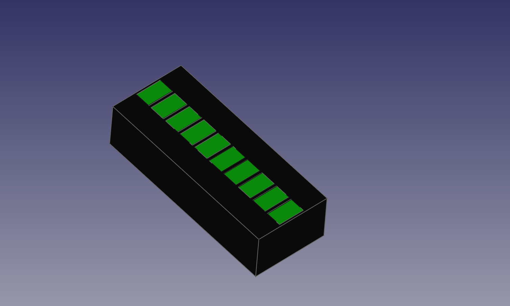

  This 10 Segment Bar Graph Display has 10 2x3x4mm square LED's.
  1" Long x 0.4" Wide x 1/4" Tall.
  
  <b>NOTE:</b> 0.25mm Nozle has to be used for this print.
  
  I did allow tolerances for fitting, however depending on your Printer you may need to adjust
  the temp accordingly if parts fit two tight print them a bit cooler. it will make a huge difference.
  
  The Display is PCB compliant (can be tiled) if you wish to mount them on one.
  driven by 74HC595 shift register or for audio a LM3914. 
  
  
